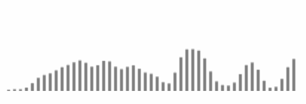

## 预览

- [在线尝试demo](https://zouyiqaq.github.io/js-music-visualization/)
## 这是什么
这是一个使用web api和js制作的简单音乐可视化demo
## 为什么要做这个
在直接使用[MDN官网](https://developer.mozilla.org/zh-CN/docs/Web/API/Web_Audio_API/Visualizations_with_Web_Audio_API)的demo时, 做出的可视化效果总是不尽人意, 总结一下, 有以下的问题:

1. 可视化的图像总是左大右小, 极度不均匀
2. 可视化无法正确表示节奏, 比如鼓点, 完全看不出效果
3. 可视化的图像总是会不停抖动, 不够稳定
4. 线条过于尖锐,

为了解决上述的问题, 在查阅资料和结合其他人的demo后做出了这个小的demo. 
## 上述问题是如何解决的
1. 对于第一点, 是因为大多数的乐曲而言, 总是低频区的能量较高, 而高频区的能量较低, 所以展示在可视化上就是左大右小. 想要解决也很简单, 只需要对需要对频率切片即可. 一般在0~1000赫兹就足以显示大部分的音乐信息了. 在demo中, 我还直接增加了高频区和减少了低频区的数字.
2. 对于第二点, 也是因为展示的音乐频率过大, 而无法精准展示小部分的频率. 而鼓点的频率大多集中在40~100赫兹. 所以只需要对频率切片即可. 
3. 对于不停抖动的问题, 我参考了ea程序中的`音频持续时间`, 对多帧内的频率取平均值即可消除抖动. 但代价是会导致可视化的变化缓慢, 根据测试, 我发现取10帧左右的数据较为不错.
4. 过于尖锐的问题实际上很好解决, 在数学上有很多解决方案, 这里我使用的是高斯平滑.

## 鸣谢
- [MDN官网 基于 Web Audio API 实现音频可视化效果](https://developer.mozilla.org/zh-CN/docs/Web/API/Web_Audio_API/Visualizations_with_Web_Audio_API)
- [music-visualizer](https://github.com/gg-1414/music-visualizer)
- [audioVisualizer](https://github.com/HTML50/audioVisualizer)